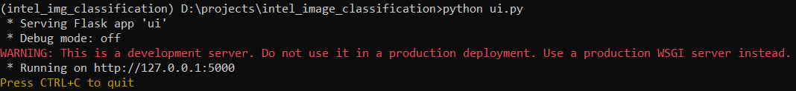

# Intel Image Classification Documentation

## Overview
This documentation provides information about the Intel Image Classification project, including the data used, the methods and ideas employed, and the accuracy achieved. It also includes usage instructions and author information.

## Data
The dataset used for training and scoring is loaded with pytorch: https://www.kaggle.com/datasets/puneet6060/intel-image-classification.

## Model Architecture
The Intel Image Classification neural network model is built using the ResNet-34 architecture. The architecture of the model consists of a series of residual blocks.

## Training
The model is trained on the provided dataset using the following configuration:
- Optimizer: Adam
- Learning rate: 0.001
- Loss function: CrossEntropyLoss
- Batch size: 1024
- Number of epochs: 20

During training, accuracy and loss are tracked to track the performance of the model.

## Accuracy
After training, the model achieved a accuracy of 0.9 on the validation set. Based on this value, the model is not bad, in most cases it correctly classifies the image that was at the input.

## Usage
To use the trained model for Intel Image Classification, follow the instructions below:

1. First go to the project folder using cmd.
2. Next install virtualenv, write the following command and press Enter:
```bash
pip install virtualenv
```
3. Next create a new environment, write the following command and press Enter:
```bash
virtualenv name_of_the_new_env
```
### Example:
```bash
virtualenv intel
```
4. Next activate the new environment, write the following command and press Enter:
```bash
name_of_the_new_env\Scripts\activate
```
5. Write the following command and press Enter:
 ```bash
pip install -r requirements.txt
```
6. After installing all the libraries, type the following command and press Enter:
 ```bash
python ui.py
```
7. After that, follow the link that appeared on the command line.
### Example:


8. After that you can insert pictures by clicking on the Choose File button and selecting them on your computer and see what class the model classifies them by pressing the Classify button.

## Author
This Intel Image Classification project was developed by Dmytro Khar. If you have any questions or need further assistance, please contact qwedsazxc8250@gmail.com.